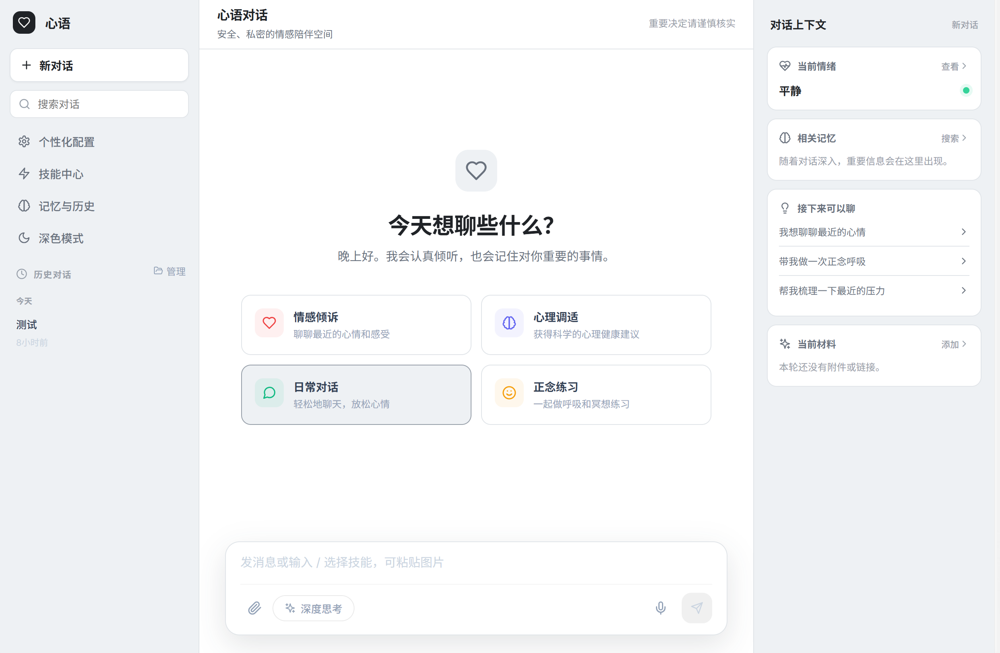

# 心语 · 情感陪伴机器人

[简体中文](README.md)

一个面向情感支持场景的开源 AI 对话应用。项目由 FastAPI 后端与 React 前端组成，集成情绪与意图识别、长期记忆、RAG 知识库、Agent 技能、流式响应和自动评估，并可连接智谱 GLM、通义千问、OpenAI 等兼容 OpenAI API 的模型服务。

> [!IMPORTANT]
> 本项目用于技术研究与情感支持，不提供医疗诊断或专业心理治疗。遇到紧急危险或自伤风险时，请立即联系当地急救机构、危机干预热线或可信赖的人。



## 功能概览

- 情感与意图理解：识别情绪、强度和对话意图，并针对危机表达执行安全策略。
- 连贯对话：组合当前上下文、历史记忆和用户画像，支持跨会话语义检索。
- RAG 知识库：通过 ChromaDB 检索心理健康、自助练习与组织策略等本地资料。
- Agent 与技能：提供任务规划、工具调用、反思、插件和 Runtime + Skills 架构。
- 多模态交互：支持文件与图片附件、语音处理及流式聊天。
- 质量闭环：包含用户反馈、自动评估、A/B 测试、性能指标和情绪趋势分析。
- 个性化前端：React 18 界面，支持 Markdown、主题、打字机效果和 AI 形象定制。

## 技术栈

| 层级 | 技术 |
| --- | --- |
| 前端 | React 18、Axios、styled-components、react-markdown |
| API | Python 3.10+、FastAPI、Uvicorn、Pydantic v1 |
| AI | OpenAI-compatible API、LangChain、Runtime + Skills |
| 数据 | MySQL / SQLite、ChromaDB、Redis（可选） |
| 运维 | Docker Compose、Nginx、Prometheus、Grafana |

## 快速开始

### 1. 准备环境

- Python 3.10 或 3.11（兼容性最佳）
- Node.js 18+ 与 npm
- 一个兼容 OpenAI API 的模型服务密钥
- MySQL 8（可选；未配置时可使用 SQLite）

```bash
git clone https://github.com/congde/emotional_chat.git
cd emotional_chat
```

### 2. 配置后端

复制示例配置：

```bash
# macOS / Linux
cp config.env.example config.env

# Windows PowerShell
Copy-Item config.env.example config.env
```

至少修改以下三项：

```dotenv
LLM_API_KEY=your_api_key
LLM_BASE_URL=https://open.bigmodel.cn/api/paas/v4/
DEFAULT_MODEL=glm-5.1
```

也可以切换到其他兼容服务，例如通义千问：

```dotenv
LLM_BASE_URL=https://dashscope.aliyuncs.com/compatible-mode/v1
DEFAULT_MODEL=qwen-plus
```

本地不使用 MySQL 时，可在 `config.env` 中启用 SQLite：

```dotenv
USE_SQLITE=1
SQLITE_PATH=./data/emotional_chat_local.db
```

完整选项见 [`config.env.example`](config.env.example)。请勿提交包含真实密钥的 `config.env`。

### 3. 安装依赖

```bash
python -m venv .venv

# macOS / Linux
source .venv/bin/activate

# Windows PowerShell
.venv\Scripts\Activate.ps1

pip install -r requirements.txt
cd frontend
npm install
cd ..
```

### 4. 同时启动前后端

在项目根目录运行：

```bash
python main.py
```

该命令会在同一个终端中启动后端和前端。按 `Ctrl+C` 可同时停止两个服务。后端启动时会检查依赖并初始化本地知识库。

- API 文档：<http://localhost:8000/docs>
- 健康检查：<http://localhost:8000/health>
- 前端页面：<http://localhost:3000>

若需要单独启动服务进行调试，可分别运行：

```powershell
# 后端
python run_backend.py

# 前端（另一个终端）
cd frontend
npm start
```

浏览器访问 <http://localhost:3000>。若后端不在本机 `8000` 端口，请创建 `frontend/.env.local`：

```dotenv
REACT_APP_API_URL=http://your-backend-host:8000
```


